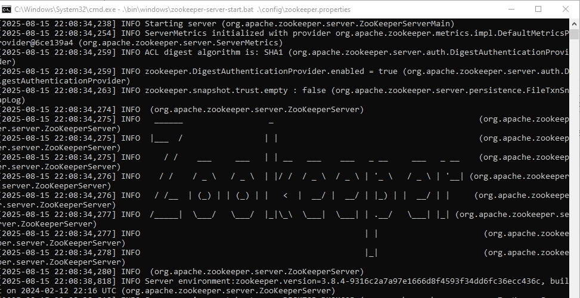
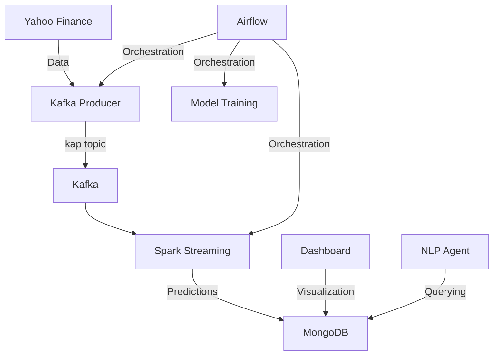
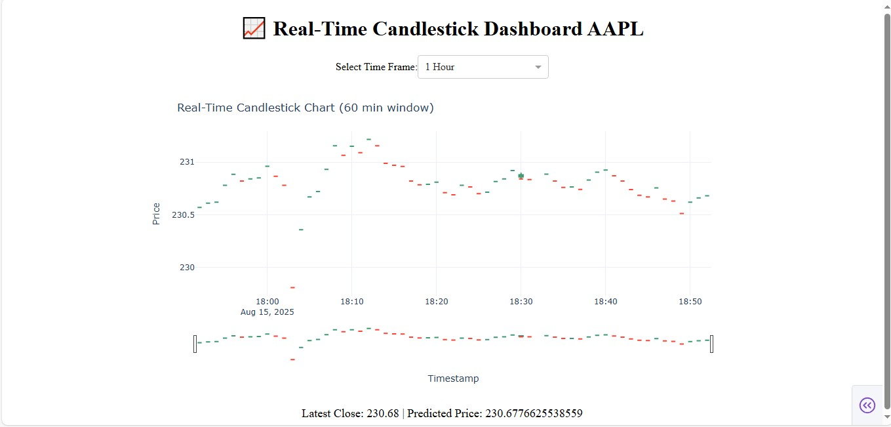
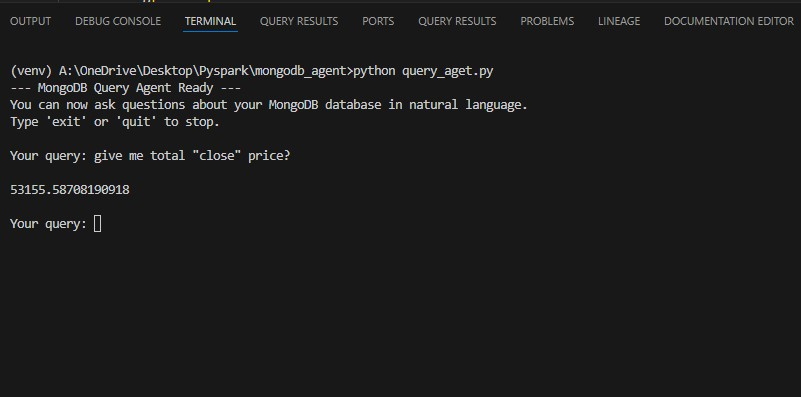

# Real-Time Stock Analysis Pipeline with Kafka, Spark, and Airflow

## Overview
This project implements a real-time stock analysis pipeline that:
1. Collects AAPL stock data using Yahoo Finance
2. Streams data through Kafka
3. Processes data with Spark Streaming using a machine learning model
4. Stores results in MongoDB
5. Provides real-time visualization and natural language query capabilities

The system is orchestrated by Apache Airflow and includes:
- Kafka producer for data ingestion
- Spark ML model for price prediction
- Real-time dashboard for visualization
- Natural language interface for MongoDB queries

## Architecture




## Components

### 1. Kafka Producer (`kafka_producer/producer.py`)
- Fetches AAPL stock data every minute from Yahoo Finance
- Sends data to Kafka topic `kap`
- Data includes: timestamp, open, high, low, close, volume

### 2. Spark Processing (`spark_app/`)
- **Model Training (`train_model.py`):** 
  - Trains Linear Regression model on historical AAPL data
  - Saves model as `model.pkl`
- **Streaming Job (`streaming_job.py`):**
  - Consumes data from Kafka
  - Applies ML model to predict next price
  - Stores results in MongoDB

### 3. Airflow Orchestration (`dags/stock_analysis_dag.py`)
- Manages pipeline dependencies
- Includes custom sensors for:
  - Zookeeper availability
  - Kafka availability
  - Topic existence check
- Coordinates component execution order

### 4. Real-Time Dashboard (`real_time_dashboard/dashboard.py`)
- Displays candlestick charts of stock data
- Shows latest predictions
- Supports multiple time frames (1min to 1 year)



### 5. MongoDB Agent (`mongodb_agent/agent_streamlit.py`)
- Natural language interface for querying predictions
- Converts natural language to MongoDB aggregation pipelines
- Built with Streamlit and Ollama LLM



## Setup Instructions

### Prerequisites
- Python 3.8+
- Java 8+
- Apache Kafka
- Apache Spark
- MongoDB
- Apache Airflow
- Docker (for Kafka/Zookeeper)

### Installation
1. Clone the repository
2. Create virtual environment:
   ```bash
   python -m venv venv
   venv\Scripts\activate
   ```
3. Install dependencies:
   ```bash
   pip install -r requirements.txt
   ```
4. Start services:
   - MongoDB: `mongod`
   - Zookeeper: `zookeeper-server-start.bat config\zookeeper.properties`
   - Kafka: `kafka-server-start.bat config\server.properties`

## Execution
1. Start Airflow scheduler and webserver
2. Trigger DAG `stock_analysis_pipeline_with_topic_sensor` in Airflow UI
3. Run dashboard:
   ```bash
   python real_time_dashboard/dashboard.py
   ```
4. Run MongoDB agent:
   ```bash
   python mongodb_agent/agent_streamlit.py
   ```

## Future Improvements
1. Add more stocks and prediction models
2. Implement alerting system for price thresholds
3. Add historical backtesting capabilities
4. Improve dashboard with technical indicators
5. Containerize entire system with Docker
